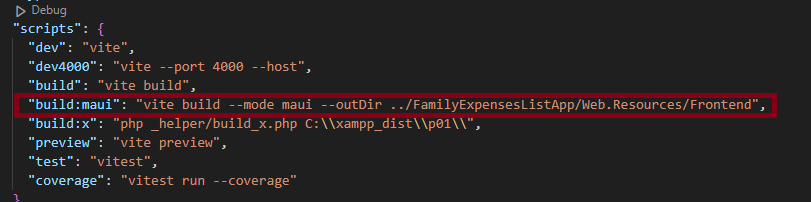
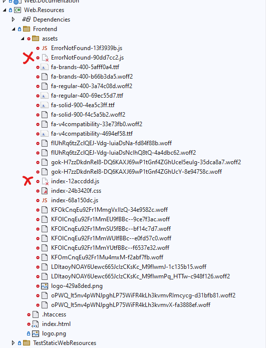
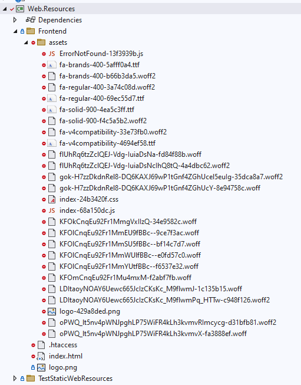

# FamilyExpensesListApp
This Project is the desktop- or mobile-app alternative for the "FamilyExpensesList"

Its use the same (remote-)[backend](https://github.com/Oigty81/family-expenses-list-backend) for use user authentication and persistence data management.
Its also use the same [frontend](https://github.com/Oigty81/family-expenses-list-frontend) with an another configuration as GUI in a webview-component.

The Project use .NET MAUI as cross-compiler thus it runs on Windows, Android and iOS Devices. 


### Project-State:
in Progress

#
### Todo

- [ ] implement controller for routes: user, category and expenses
- [ ] update config-data-provider for common app -> load config from external file
- [ ] add optionally basic authentication service for local TCP/HTTP-Channel
- [ ] add HTTP-Client for communication with remote-backend
- [ ] implement dynamic free-port-search for Webservicehost
- [ ] implement offline modus (temporary datastore with SQLite and Data-Merger)
- [ ] add unit tests for significant classes


## Project setup

### Prerequisite

- [Visual Studio 2022](https://visualstudio.microsoft.com/de/downloads/)
- [PHP](https://www.php.net/downloads.php) (to run the script for link the frontend-bundle-files to the Web.Resources project)

### Install the repository
```
git clone https://github.com/Oigty81/FamilyExpensesListApp.git
```

### Build-Scripts
- `BUILD_WINDOWS.bat` to build a Windows-Desktop-App for Any-CPU
- `BUILD_ANDROID_WITHOUT_KEYSTORE.bat` to build a Android APK-File without a keystore signature

#
### Frontend Build and Setup

- first build frontend bundle (use npm script from frontend `package.json`)
- make sure to correct set output directory to the Web.Resources-Project -> "/Frontend" folder



- make sure to correct set the environment variables in `.env.maui`
```
VITE_LOCAL_HISTORY_MODE=true
VITE_LOCAL_USE_FOR=app
VITE_LOCAL_REQUEST_BASE=/api
VITE_LOCAL_REQUEST_BASE_VERSION=
```

- excecute this script

```
npm run build:maui
```

- after the bundle-build in your `FamilieExpensesListApp`-Project Visual-Studio possibly shows the old embedded-file-references from a previous build



- run the batch-file `REFRESH_FRONTEND_EMBEDDED_RESOURCES.bat` in root-folder or rebuild the `Web.Resources`-Project (make sure php is installed)



- start or build the `FamilieExpensesListApp` now